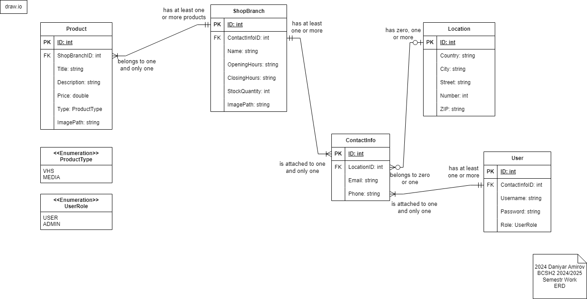

# TapeHub - simple user-friendly Android app.

## Demo

(demo-intro.gif)

## About

**TapeHub** - is a...

## Frameworks and Tools

## .NET MAUI and MVVM

**.NET MAUI** - is a multi-platform framework for creating native mobile and desktop applications. It is a part of the .NET 6 release. It is based on Xamarin.Forms and uses the same concepts and APIs.

**Xamarin.Forms** - is a cross-platform UI toolkit that allows creating native user interface layouts that can be shared across Android, iOS, and Windows.

**MVVM** (Model-View-ViewModel) - is a design pattern (architecture) used primarily in UI-based applications to separate the concerns of data, user interface, and business logic. MVVM is widely used in XAML-based frameworks such as .NET MAUI, WPF, and Xamarin.Forms.
- **Model** (M): Represents the data and business logic of the application. It handles all the operations related to retrieving, storing, and updating the data (e.g., interacting with databases or APIs);
- **View** (V): Represents the user interface (UI). This is typically written in XAML in .NET MAUI. The view binds to the data exposed by the ViewModel, reacting to changes in the data to update the UI dynamically;
- **ViewModel** (VM): Acts as a bridge between the View and the Model. It exposes data and commands to the View through data binding and handles UI-related logic. It communicates with the Model to retrieve and update data, without the View directly interacting with the Model;

## Entity Relationship Diagram (ERD)

## Next Headings...

## Contacts

